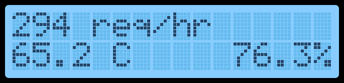

# rpi-lcd-server

General-purpose program for showing statistics on a Raspberry Pi with an LCD display.



## Usage

An example configuration can be found in `example-config.json`.
```bash
npm run build
npm start /path/to/config.json
```

## Features

- You don't have to switch or scroll the status text yourself. The hard part is done for you.
- You can show any statistic or text you want on the LCD screen using any program you want. `rpi-lcd-server` has an HTTP API which can be accessed on port 8485 by default, making it easy to add or update statistics on the screen.

## HTTP API

All requests that have a body must have the content type `application/x-www-form-urlencoded`.

### GET `/v1/status/:service`

Gets the current status for the specified service.

```json
{
  "value": "294 req/hr",
  "lastUpdate": "2021-09-21T15:58:06.456Z",
  "expireDate": "2021-09-21T16:00:06.456Z"
}
```

### GET `/v1/services`

Returns all active services and the index for the service that is currently being displayed on the LCD screen.

```json
{
  "services": [
    "my-web-server",
    "my-bluetooth-service"
  ],
  "currentService": 1
}
```

### DELETE `/v1/status/:service`

Immediately deletes the specified service. The status for this service will no longer be displayed until a subsequent `PUT` request.

```json
{}
```

### PUT `/v1/status/:service`

Sends a status update for a service. The status will keep being displayed on the LCD until it expires or until a `DELETE` request is sent for it.

Supported query items:
- `expire`: The number of milliseconds until the new status expires.
- `value`: The new status.

**Example body:** `expire=60000&value=294%20req%2Fhr`
- Expires in 60000 milliseconds (1 minute)
- Status is "294 req/hr"

```json
{}
```